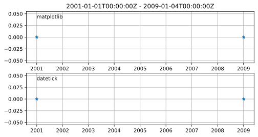
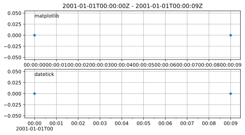

# datetick

Sensible numeric time and date tick labels for Matplotlib

# Motivation

Matplotlib's default time tick labels are rarely useable, and adjusting the time tick labels requires using locators and formatters on an ad-hoc basis.

# Usage

```
import datetime as dt
import matplotlib.pyplot as plt
from datetick import datetick
dt1 = dt.datetime(2011, 1, 2)
dt2 = dt1 + dt.timedelta(days=1, hours=1, minutes=1)
x = [dt1, dt2]
y = [0.0,1.0]
plt.clf()
plt.plot(x, y)
datetick('x')
plt.show()
```

# Comparison to default Matplotlib








